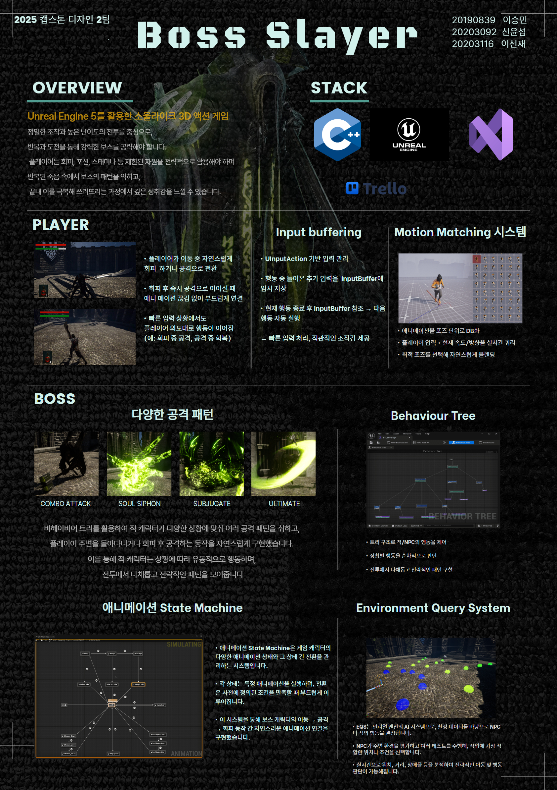

# Boss Slayer  
### Capstone Design 2025-02



---

## ✨ 프로젝트 개요

**Boss Slayer**는 Unreal Engine 5로 개발된 소울라이크 액션 어드벤처 게임입니다.  
정밀한 조작과 반복 도전을 통해 보스를 공략하는 고난이도 전투를 중심으로 구성되어 있으며,  
회피, 포션, 스태미나 등 제한된 자원을 전략적으로 사용해 패턴을 익히고 극복하는 과정을 통해 깊은 몰입감을 제공합니다.

---

## 🚀 기술적 강점

### ▶️ 모션 매칭
- 다양한 애니메이션 클립을 포즈 단위로 분해하여 DB화한 후, 입력 및 캐릭터 상태를 기반으로 목표 포즈를 예측해 실시간 전환합니다.
- 회피 후 공격 등 빠른 동작 간 연결에서 자연스러운 애니메이션 흐름을 구현했습니다.


### ▶️ 인풋 버퍼링
- 행동 중 들어온 입력을 버퍼에 저장하고, 해당 행동이 끝난 후 이를 수행하여 플레이어 입력을 놓치지 않고 처리합니다.
- 빠른 반응성과 조작감을 제공해 쾌적한 전투 경험을 제공합니다.


### ▶️ 비헤이비어 트리
- 언리얼의 Behavior Tree를 활용하여 보스의 공격, 이동, 회피 등을 조건 기반으로 제어합니다.
- 트리 구조 덕분에 다양한 상황에 맞춘 전략적 행동이 가능하며, 시각적으로 관리가 용이합니다.


### ▶️ 보스 스킬 & 공격 패턴
- 보스는 다양한 전투 기술을 상황에 맞춰 전략적으로 구사합니다. 해당 스킬들은 비헤이비어 트리 로직과 연동되어 사용됩니다.


### ▶️ EQS 시스템
- Environment Query System을 통해 플레이어와의 거리, 장애물 등을 평가하고 최적의 공격 위치를 탐색합니다.
- 이를 통해 보스가 동적으로 위치를 조정하며 공격 전략을 세울 수 있도록 했습니다.

### ▶️ 애니메이션 State Machine
- 보스의 이동/공격/회피 애니메이션 간 상태 전환을 자연스럽게 연결하며,
- Aim Offset을 통해 항상 플레이어를 바라보도록 구성했습니다.


---

## 👥 팀원 소개

<a href="https://github.com/706-Camille" target="_blank"></a> **이승민** 팀장

<a href="https://github.com/sys010611" target="_blank"></a> **신윤섭**

<a href="https://github.com/seonjae01" target="_blank"></a> **이선재**


---
## 🛠️ 기술 스택

| Unreal Engine 5 | C++ | GitHub | Trello | Visual Studio |
|:---------------:|:--:|:------:|:------:|:--------------:|
|  |  |  |  |  |

---

## 📦 설치 및 실행 방법

1. **필수 환경**
   - Unreal Engine 5.3 이상
   - Visual Studio 2022 (C++ 개발 도구 포함)

2. **프로젝트 클론 및 열기**
   ```bash
   git clone https://github.com/kookmin-sw/capstone-2025-02.git
   cd capstone-2025-02
   ```

3. **프로젝트 빌드**
   - 처음 실행 시 Visual Studio에서 `.sln` 파일을 열고 `Development Editor` + `Win64`로 빌드 진행


---

